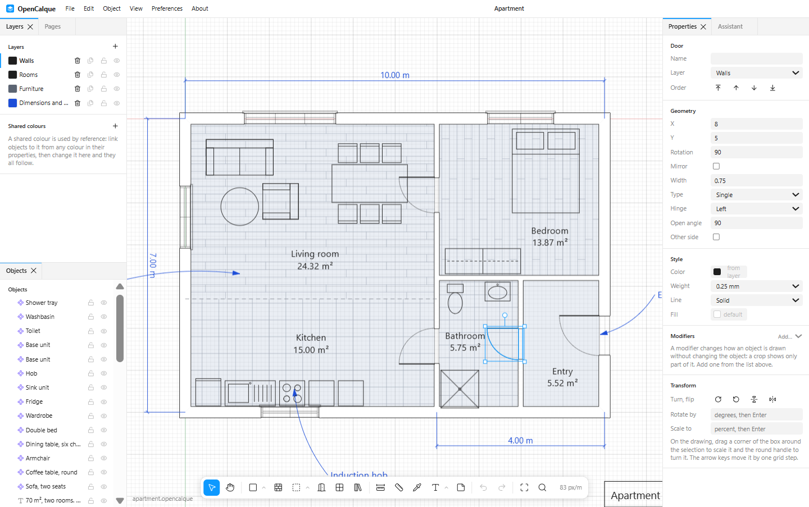
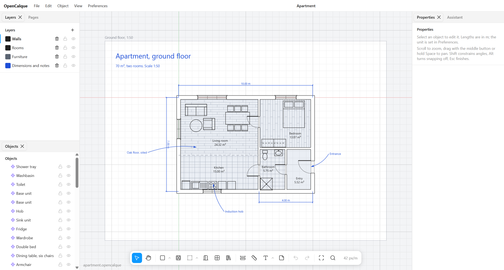

<h1 align="center">OpenCalque</h1>

<p align="center">
  <strong>Open-source 2D architectural editor.</strong><br>
  Floor plans and layouts with a Figma-like interface, a local CLI, and a plain JSON format made for scripts and AI agents. Free, and yours to run.
</p>

<p align="center">
  <a href="https://github.com/laurent512/opencalque/releases/latest"></a>
  <a href="LICENSE"></a>
  
  
  
  <a href="#contributing"></a>
</p>



*Calque* is French for tracing paper, and for a layer. OpenCalque is a drafting table for buildings: draw walls that join themselves, drop in doors, windows and stairs that know how to behave, name rooms and get their area, then frame it all on a sheet. It is a desktop app and a web app from the same code, and everything it saves is a file you can read.

> **Status: early but usable.** The editor works end to end and is covered by tests. [Download it](#download) or run it from source, and see [what is not there yet](#what-is-not-there-yet) and [what changed lately](CHANGELOG.md).

## Why OpenCalque

| | |
| --- | --- |
| **Figma-like, not CAD-like** | A toolbar, panels you can dock anywhere, a command list on `Ctrl+K` with every shortcut rebindable, hints that show only the next step. No command line to memorise. |
| **Built for buildings** | Walls mitre at any angle and stay joined when you move one. Doors and windows snap into walls and cut them. Rooms are found from the walls and report their area. |
| **Non-destructive** | Components update everywhere at once. Modifiers such as crop and floor patterns change how something is drawn without changing it, and can be switched off at any time. |
| **Open by design** | A drawing is plain JSON with a published schema. Every edit is a small JSON operation, the same ones the editor, the CLI and the assistant use. |
| **Works with AI, or without** | A built-in assistant edits the drawing from a description, through Claude, a local model with Ollama, or any OpenAI-compatible service. The rest of the app never goes online. |
| **Free** | MIT licensed. No account, no subscription, no telemetry. |

## A first look



Both pictures are [`examples/apartment.opencalque`](examples/apartment.opencalque), a file generated by [a 100-line script](packages/cli/src/build-example.ts) through the same operations the editor uses.

## Download

Installers for each version are on the [releases page](https://github.com/laurent512/opencalque/releases/latest):

| System | File |
| --- | --- |
| Windows | `OpenCalque-…-windows-setup.exe` to install, or `…-windows-portable.exe` to run without installing |
| macOS | `OpenCalque-…-mac-….dmg` |
| Linux | `OpenCalque-…-linux-….AppImage` |

The builds are not signed, so the system asks before running them the first time: on Windows choose "More info", then "Run anyway"; on macOS right-click the app and choose Open. When it starts, pick **Start with the example** to get a furnished flat to take apart.

## Run from source

Requires [Node](https://nodejs.org) 22 or newer and [pnpm](https://pnpm.io) 9.

```sh
git clone https://github.com/laurent512/opencalque.git
cd opencalque
pnpm install
pnpm dev          # the desktop app, with hot reload
```

The welcome window offers a new drawing, a file, or the example: a furnished flat, which is [`examples/apartment.opencalque`](examples/apartment.opencalque).

```sh
pnpm dev:web      # the same editor in a browser
pnpm build && pnpm start   # the built desktop app
pnpm test         # 135 tests
pnpm dist         # build the installer for the system you are on, into apps/desktop/dist
```

## What you can do

**Draw**
- Walls by centerline and thickness, joined cleanly at any angle; a double-click closes a room.
- Corners you can select and drag, with a choice of joint: mitred, rounded, cut off, or one wall running through.
- Doors, windows, four kinds of stairs and a compass for north, each with its own parameters.
- Lines, rectangles, ellipses and arcs, polylines straight or curved, and annotations with curved, straight or elbowed leaders.
- Text typed in place, on several lines, bold or not, aligned left, centred or right, with fields such as `{date}` or `{page}` that fill themselves in.
- Line weights in printed millimetres, dashed and dotted lines, arrows at the ends.
- Exact sizes: type a length or an angle while drawing, in mm, cm, m, inches or feet.
- Dimensions with configurable ends, text and units; a measure tool that only reads.

**Organise**
- Rooms that follow their walls, with name and area; dividers to split an open space.
- Papers: sheets at a standard format and drawing scale (A5 to A0) that carry what is drawn on them.
- Pages you can duplicate and reorder; layers, with shared layers that show on every page (a frame, a logo); groups and reusable components.
- Shared colours: link objects to a named colour and recolour them all at once.
- Rotate, flip, scale and nudge any selection, from handles, the keyboard or exact values; align and space evenly.
- Repeat an object in rows and columns without multiplying objects.
- Change what several objects have in common in one go, or copy a look from one object to others with the eyedropper.

**Reuse**
- A searchable, illustrated component library: furniture, kitchen, bathroom and electrical symbols.
- Extensions that add new parametric objects as data, not code, so installing one is safe.
- Any drawing can be used as a library; catalogs can be published anywhere on the web.

**Bring in and take out**
- Drop a PDF or a picture to trace it, and set its scale from one known distance.
- Import a DXF from another CAD program: lines, polylines, circles, arcs and text, on their layers.
- Export a vector PDF at true scale, one page per paper, with a title block. Also SVG and DXF.

The full inventory and roadmap are in [docs/FEATURES.md](docs/FEATURES.md).

## A local CLI

Everything the editor does to a drawing, a script can do too.

```sh
pnpm opencalque new plan.opencalque "My plan"
pnpm opencalque apply plan.opencalque examples/studio.ops.json   # apply a JSON array of operations
pnpm opencalque describe plan.opencalque                         # a JSON summary, good context for an AI agent
pnpm opencalque pdf plan.opencalque --out plan.pdf               # every paper as a page, at its real size and scale
pnpm opencalque svg plan.opencalque --out plan.svg
pnpm opencalque dxf plan.opencalque --out plan.dxf
pnpm opencalque validate plan.opencalque
pnpm opencalque schema --out schema                              # JSON Schemas of documents and operations
```

A wall is one operation:

```json
{ "op": "add_node", "node": { "type": "wall", "parent": "page_1", "a": { "x": 0, "y": 0 }, "b": { "x": 6000, "y": 0 }, "thickness": 200 } }
```

A batch is all-or-nothing and every result is validated, so a script or a model cannot leave a drawing broken. Details are under [Operations](#operations).

## Practical workflows

- **Trace an existing plan.** Drop a scan or a PDF, click two points you know the distance between, and draw over it.
- **Describe it.** Ask the assistant for "a 5 × 4 m room with a door on the bottom wall", paste a sketch, and undo the whole request with one `Ctrl+Z`.
- **Generate it.** Produce a plan from a script or an agent with operations, then open it to adjust by hand. The example apartment is made this way.
- **Furnish and annotate.** Pick symbols from the library, name the rooms, add a floor pattern, dimension the walls.
- **Frame it and print it.** Lay an A3 at 1:50 around the plan, fill in the title block, and export a PDF on which one metre measures 20 mm.

<details>
<summary><strong>Editor guide: every tool and shortcut</strong></summary>

| Action | How |
| --- | --- |
| Start | The welcome window offers a new drawing, a file, a recent drawing (desktop app) or the example. Switch it off there or under Preferences; bring it back from Preferences → Welcome window |
| Menus | File, Edit, Object, View and Preferences are in the bar at the top, which in the desktop app is also the window's title bar; the tools are in the bar under the drawing. About shows the version and what is new |
| Language | English, French, Spanish and German. The app follows your system language; change it under Preferences |
| Panels | Drag a panel's tab to another edge, onto another panel to share its tabs, or out to float. Close and reopen panels from View. Preferences → Reset the panel layout puts everything back |
| Drop files | Drag a picture or a PDF from your file manager onto the drawing to trace it, a `.dxf` to add its geometry, an `.opencalque` file to open it, or an extension `.json` to install it |
| Trace a floor plan | File → Import floor plan, and pick a PDF or a picture (PNG, JPG, WebP…). Then set its scale: click two points whose real distance you know and type that distance (`3500`, `350 cm`, `3.5 m`). The plan is then locked so you can draw over it |
| Assistant | The Assistant tab on the right (`Ctrl+J`) changes the drawing from a description, such as "draw a 5 × 4 m room with a door on the bottom wall". Each request is undone with one undo. It needs an AI provider, set up in Preferences |
| Conversations | The assistant keeps your conversations: pick one at the top of its panel, or type `/resume`. `/new` starts one, `/model` changes the model (also the list under the message), `/clear` deletes. Paste a picture (`Ctrl+V`) or use the paperclip to show it a sketch |
| Units | Preferences → Unit: millimetres, centimetres, metres, inches or feet. A different unit can always be typed after a number (`350 cm`) |
| Autosave | On by default (File → Save automatically): a drawing is saved to its file a moment after each change. Save a new drawing once to give it a file |
| Commands | `Ctrl+K` (`Cmd+K` on macOS) lists every command; type to filter, Enter to run. Click a command's shortcut there to change it, Backspace to remove it. Your shortcuts are remembered on this computer |
| Tools | `V` select, `H` pan, `L` line, `R` rectangle, `O` ellipse, `P` polyline, `W` wall, `D` dimension, `M` measure, `T` text, `I` eyedropper. The plain shapes share one toolbar button; the arrow beside it lists them |
| Exact sizes | While drawing, a bar above the tools shows the shape's sizes. Type a number (just start typing) to fix one, Tab to the next, Enter to draw. For a rectangle, type both and click once to place it |
| Draw | Click the first point, click the second. Lines and walls keep chaining; `Esc` or a double-click ends. Dragging also works |
| Navigate | Scroll to zoom, middle-drag or `Space`+drag to pan, `Shift+1` to fit |
| Snapping | Snaps to existing points, then to the grid. `Shift` constrains to 45°, `Alt` turns it off |
| Edit | Drag objects or their square handles, or type exact values in the right panel |
| Components | Select objects, `Ctrl+Alt+K`. Place, rename, edit and delete them from the component library. Double-click an instance to edit the component; every instance updates |
| Walls | Walls that end at the same point join cleanly, at any angle. Double-click the last corner to close the walls back to the first one |
| Dimensions | `D`, click the two points, then click where the dimension line should sit. End markers, line, extension lines, text, font, unit and decimals are in the right panel; set them before drawing to change the defaults |
| Measure | `M`, click two points for a live reading. Nothing is added to the drawing |
| Text | `T`, click, and type: the text is written on the drawing as you type. Enter starts a new line; `Esc`, `Ctrl+Enter` or a click elsewhere finishes; double-click a text to change it |
| Fields | In a text, `{date}`, `{page}`, `{page-number}`, `{pages}` and `{document}` are replaced by the drawing's own values. Insert them from Fields in the right panel |
| Lines | Weight (as printed, 0.13 to 1.4 mm), kind of line (solid, dashed, long dashes, dotted, dash and dot) and arrows at each end are in the right panel. While a drawing tool is in use, the bar above the tools sets them for the next shapes |
| Several objects | With several selected, the right panel shows what they have in common; a value that differs reads "Mixed", and changing it changes them all |
| Eyedropper | The pipette in the Style section of the right panel, or `I`, then click an object: its colours, weight and kind of line go to the selection, or to the next shapes when nothing is selected |
| Align | With two or more selected, Arrange in the right panel aligns them left, centre, right, top, middle or bottom; with three or more it spaces them evenly |
| Pages | In the Pages panel: add, rename, duplicate with everything on it, move up or down |
| Shared layers | In the Layers panel, the pages icon on a layer shows what is on it on every page: a frame, a logo, a title. It is changed on the page it was drawn on |
| Component library | The books button in the toolbar: every object and component, pictured, with a search. Click one, then click on the drawing |
| Doors and windows | The Door or Window button in the toolbar, then click on a wall: it snaps on, turns to follow the wall, opens towards your cursor and cuts the opening. Drag it to slide it along the wall. Type, hinge side, width and more are in the right panel |
| Compass | Component library → Compass (north). Turn it with the round handle above it, or type its rotation; size and letter are in the right panel |
| Select | Click an object. A component or a library object is picked anywhere inside its outline; a plain shape with no fill by its line. A room is picked by its name, so what stands on its floor stays easy to click |
| Arcs and curves | Draw an ellipse (`O`), then type a start and an end angle under "Arc from" and "Arc to" in the right panel: angles run clockwise from the right. Tick Curved on a polyline to make it flow through its points |
| Repeat | Select something, Object → Repeat in rows and columns, then set how many across, how many rows and the steps under Modifiers. The copies are drawn, not made: change the object and they all follow |
| Import DXF | File → Import DXF, or drop the file. It must be a text (ASCII) DXF; a DWG has to be saved as DXF first. Blocks, hatches and dimensions are not read |
| Stairs | Component library → straight, L-shaped, U-shaped or spiral. `R` rotates before placing. Steps, tread, width and turn direction are in the right panel |
| Groups | `Ctrl+G` groups the selection, `Ctrl+Shift+G` ungroups. Double-click a group to edit inside it |
| Order | `]` to front, `[` to back, `Ctrl+]` and `Ctrl+[` one step. Also in the properties panel, the right-click menu, or drag rows in the Structure panel |
| Right-click | On an object or the drawing, for order, grouping, copy and paste |
| Copy and paste | `Ctrl+C`, `Ctrl+X`, `Ctrl+V`, also between drawings |
| Paper | `F`, click a corner, pull: the standard formats (A5 to A0) appear at the scale shown in the bar, upright or lying as you move; come close to one to take it, or hold `Alt` for any size. A paper carries what is drawn on it when moved, copied or duplicated; grab it by its edge or its name |
| Joined walls | Moving a wall, or dragging one of its corners, stretches the walls that meet it and takes its doors and windows along. Hold `Alt` to move it alone |
| Drag a number | Hold `Alt` over a number in the panels and drag sideways to change it; `Shift` goes ten times faster |
| Transform | Select, then drag a corner of the box to scale or the round handle above it to turn (`Shift` for 15° steps). `Shift+R` turns a quarter, `Shift+H` and `Shift+V` flip, the arrow keys move by one grid step. Exact angles and percentages are in the right panel, under Transform |
| Annotation | The arrow beside the text button, or `Shift+T`: click what the note is about, click where the note goes, type it. Ends (arrow, open arrow, dot, tick, none), path (curved, straight or elbow) and text size are in the right panel; drag the middle of the line to bend it |
| Corners | Click the end of a wall to select the corner: drag it and every wall that meets there follows. In the right panel, choose how two walls are joined: mitred, rounded, cut off, or one running through. Double-click a wall to put a corner in it |
| Rooms | `A`, then click inside closed walls: the room gets a tinted floor, a name and its area, and follows the walls when they move. Pick it by its name. The arrow beside the button has the divider (`Shift+A`), a dashed line that splits an open space into two rooms |
| Floor pattern | Select a room (or any closed shape), Object → Hatch or floor pattern, then choose lines, planks or tiles and the spacing under Modifiers |
| Colours | A colour field opens a picker, the colours you picked lately, and the drawing's shared colours |
| Shared colours | In any colour field, choose "New shared colour from this one", then link other objects to it from the same list. Change it in the Colours panel and everything linked follows. A linked colour shows its name with a link icon |
| Crop | Select something (an object, a group, a placed component), Object → Crop: only the part inside the orange rectangle is drawn. Drag its corners to change it. Nothing is cut: switch it off or remove it under Modifiers in the right panel |
| Extensions | Preferences → Extensions adds new kinds of object: install, remove, switch off, or load more from a web catalog |
| Export | File → Export PDF (`Ctrl+P`) for sheets at true scale: the selected papers, or all of them, one page each. Tick "Title block" on a paper for a border and a cartouche. Also Export SVG, and Export DXF for other CAD programs |
| Files | `Ctrl+S` save, `Ctrl+O` open, `Ctrl+Z` / `Ctrl+Shift+Z` undo and redo, `Ctrl+D` duplicate |

A component library is just another `.opencalque` file: **File → Import component library** copies its components in.

</details>

## The assistant and your data

The assistant can use, chosen under Preferences:

- **Claude with an API key** (Anthropic).
- **Claude through the Claude Code CLI** installed on your computer, using the account it is signed in to. Desktop app only; no API key needed.
- **A local model through Ollama.** Nothing leaves your computer. In the desktop app this works out of the box; in a browser Ollama must be told to accept the page (`OLLAMA_ORIGINS`).
- **Any other service** that accepts the OpenAI chat-completions format and supports tool calling.

- An API key, when one is used, is stored on your computer, unencrypted, and is sent only to the provider you chose.
- When you send a request, the drawing is sent to that provider as JSON. Imported pictures are left out, unless the assistant asks to look at one (for example to trace a plan), in which case that picture is sent.
- Pictures you attach are sent with that message. Conversations are kept on your computer (without the pictures' full data) until you delete them.
- Nothing is sent anywhere unless you use the assistant. The rest of the app works offline.

## How it is organised

```
packages/core              The document model. No UI, no DOM, runs anywhere.
packages/ext-architecture  Bundled extension: doors, windows, stairs, "insert room" command.
packages/cli               Command-line access to the model.
apps/web                   The editor: React + Canvas. Deployable as a static site.
apps/desktop               Electron shell around apps/web: native file dialogs, recent files, installers.
```

Three decisions shape everything else:

1. **The model is headless.** `@opencalque/core` owns the file format, validation, editing, components, hit-testing and SVG export. The editor is one client of it; the CLI is another.
2. **The editor is a web app first.** The desktop shell only implements the small [`Platform`](apps/web/src/platform.ts) interface (open, save, unsaved-changes prompt). Hosting the editor online, or replacing Electron with Tauri, means writing another implementation of that interface.
3. **Documents change only through operations.** An operation is plain JSON and touches one node or one layer. The UI, undo, the CLI and extensions all go through `applyOps`. This is also what makes realtime collaboration feasible later: operations can be relayed through a server and merged last-writer-wins per node.

## The file format

A `.opencalque` file is JSON. JSON Schemas for documents and operations are in [`schema/`](schema) (regenerate with `pnpm schema`).

```jsonc
{
  "format": "opencalque", "version": 1, "id": "doc_…", "name": "Studio", "unit": "mm",
  "layers": {
    "layer_1": { "id": "layer_1", "name": "Walls", "order": "a0" }
  },
  "nodes": {
    "page_1": { "id": "page_1", "type": "page", "parent": null, "order": "a0" },
    "n_1":    { "id": "n_1", "type": "wall", "parent": "page_1", "order": "a0", "layer": "layer_1",
                "a": { "x": 0, "y": 0 }, "b": { "x": 6000, "y": 0 }, "thickness": 200 }
  }
}
```

- **Units** are millimetres. X grows right, Y grows down.
- **Nodes are a flat map.** The tree is each node's `parent` plus `order`, a fractional index that sorts as a plain string. There are no child arrays, so two people inserting into the same page never conflict.
- **Pages and components are the containers.** Every other node belongs to one of them.
- **Groups** are nodes too: a `group` holds other nodes (their `parent` is the group) and has no geometry of its own.
- **Node types:** `wall`, `room`, `divider`, `line`, `polyline`, `rect`, `ellipse`, `text`, `annotation`, `dimension`, `paper`, `image`, `group`, `instance` (a placed component) and `parametric` (an object generated by an extension from `props`).
- **Derived, not stored.** A room keeps a point and a name; its outline and area come from the walls around it. A paper holds whatever lies on it. Nothing in the file can go stale when a wall moves.
- **Modifiers** are non-destructive: any node can carry a list such as a crop or a floor pattern, applied in order when it is drawn.
- **Unknown parametric kinds survive.** A file that uses an extension you do not have still opens; those objects show as placeholders and are saved back untouched.

## Operations

```json
[
  { "op": "add_layer", "layer": { "id": "furniture", "name": "Furniture", "color": "#2563eb" } },
  { "op": "add_node", "node": { "type": "wall", "parent": "page_1", "a": { "x": 0, "y": 0 }, "b": { "x": 6000, "y": 0 }, "thickness": 200 } },
  { "op": "update_node", "id": "n_1", "patch": { "thickness": 300, "name": null } },
  { "op": "remove_node", "id": "n_1" }
]
```

`add_node` generates `id` and `order` when omitted. `update_node` shallow-merges the patch; `null` removes a property; setting `parent` or `order` moves the node. A batch is all-or-nothing, and every result is validated, so an invalid document cannot be produced.

A new document always starts with page `page_1` and layer `layer_1`, so a script can target it without reading it first.

### From the command line

```sh
pnpm opencalque new plan.opencalque "My plan"
pnpm opencalque apply plan.opencalque examples/studio.ops.json   # apply a JSON array of operations
pnpm opencalque describe plan.opencalque                         # JSON summary, useful as context for an AI agent
pnpm opencalque svg plan.opencalque --out plan.svg
pnpm opencalque validate plan.opencalque
```

`examples/studio.opencalque` was produced exactly this way from [`examples/studio.ops.json`](examples/studio.ops.json).

### From code

```ts
import { applyOps, createDocument, serializeDocument } from '@opencalque/core'

const doc = applyOps(createDocument('Plan'), [
  { op: 'add_node', node: { type: 'rect', parent: 'page_1', x: 0, y: 0, width: 1200, height: 700 } },
])
```

Documents are immutable: `applyOps` returns a new one.

## The warehouse

Components and extensions can be added from inside the app. What ships with it lives in [`apps/web/src/warehouse`](apps/web/src/warehouse): component libraries are ordinary `.opencalque` drawings (generated by `pnpm warehouse` from [`packages/cli/src/build-warehouse.ts`](packages/cli/src/build-warehouse.ts)), and extensions are JSON files.

To publish your own, host a catalog anywhere that serves files with CORS enabled, and give people its address to paste into the warehouse:

```json
{
  "libraries": [{ "name": "Garden", "description": "Trees and planters", "file": "garden.opencalque" }],
  "extensions": [{ "file": "garden-objects.json" }]
}
```

An extension in the warehouse is **data, not code**. It describes objects with shapes whose coordinates are small expressions over the object's parameters:

```json
{
  "format": "opencalque-extension", "formatVersion": 1,
  "id": "example.garden", "name": "Garden", "version": "1.0.0",
  "objects": [{
    "kind": "garden.tree", "label": "Tree",
    "params": [{ "key": "crown", "label": "Crown", "type": "number", "default": 1500 }],
    "draw": [
      { "ellipse": { "cx": 0, "cy": 0, "rx": "crown / 2", "ry": "crown / 2" } },
      { "ellipse": { "cx": 0, "cy": 0, "rx": 80, "ry": 80 } }
    ]
  }]
}
```

Shapes are `path`, `ellipse`, `arc` and `text`; each can have `when` (a condition) and `repeat` (a count, with the index available as `i`). Expressions support arithmetic, comparisons, `?:`, and `min max abs floor ceil round sqrt sin cos`. Text can embed values: `"{length / 1000} m"`. An `opening` makes the object cut walls like a door. The three bundled extensions are worked examples.

## Writing an extension in code

For anything a data-only extension cannot express (custom geometry logic, commands), write one in TypeScript. It depends only on `@opencalque/core`. It can register **parametric objects** (a list of parameters and a function that turns them into drawing primitives) and **commands** (which read the document and apply operations).

```ts
import type { Extension } from '@opencalque/core'

export const columns: Extension = {
  id: 'example.columns',
  name: 'Columns',
  version: '1.0.0',
  activate(api) {
    api.registerParametric({
      kind: 'example.column',
      label: 'Round column',
      params: [{ key: 'diameter', label: 'Diameter', type: 'number', default: 300 }],
      build: ({ diameter }) => [{ kind: 'ellipse', cx: 0, cy: 0, rx: diameter / 2, ry: diameter / 2, fill: '#d4d4d4' }],
    })
  },
}
```

Because objects describe themselves as primitives (paths, ellipses, text), a new object type automatically gets rendering, selection, snapping, a properties form and SVG export. Add an `opening` function and the object also cuts and snaps to walls, and `build` is told the wall's thickness. [`packages/ext-architecture`](packages/ext-architecture/src/index.ts) is the reference.

Extensions are currently compiled in: add yours to the registry in [`apps/web/src/store.ts`](apps/web/src/store.ts). Loading them at runtime is not built yet.

## What is not there yet

- **Installers** are not signed and do not update themselves: download the next version from the releases page.
- **Release notes** and the example drawing are in English only. Recent drawings are listed in the desktop app only.
- **Printing.** PDF export uses the standard fonts of PDF readers (sans-serif, serif, monospace, plain or bold), so text is close to the screen but not identical, and letters outside Western European alphabets print as "?". Pictures other than JPEG and PNG are left out. A sheet cannot yet show a part of the plan at another scale.
- **Drawing.** Arcs are made by typing angles, not yet drawn with a tool of their own. Scaling is uniform only.
- **Walls.** No curved walls yet.
- **Import.** One page of a PDF at a time. DXF import reads lines, polylines, circles, arcs, ellipses and text, not blocks, hatches or dimensions, and not binary DXF or DWG.
- **Hosted version.** Accounts, cloud storage and realtime collaboration are planned; the data model is prepared for them, nothing is built.
- **Extensions.** Those installed at runtime can add objects and modifiers as data. Extensions that add tools must be compiled in.

## Contributing

Issues and pull requests are welcome. Start with [docs/ARCHITECTURE.md](docs/ARCHITECTURE.md): it explains the design, the rules that keep the model open (documents change only through operations, the core has no UI), and what has and has not been verified. [`CLAUDE.md`](CLAUDE.md) holds the same rules in short form for AI coding agents.

Good first contributions: a component library for your trade, a translation, a data-only extension, or one of the items above.

### Releasing a version

1. Add a `## x.y.z — date` section at the top of [CHANGELOG.md](CHANGELOG.md) and set the same version in the `package.json` files (a test checks they agree).
2. Commit, then `git tag vx.y.z && git push origin main vx.y.z`.

The [release workflow](.github/workflows/release.yml) builds the Windows, macOS and Linux installers and publishes a GitHub release with them, described by that section of the changelog. The app shows the same notes under About.

## License

[MIT](LICENSE)
